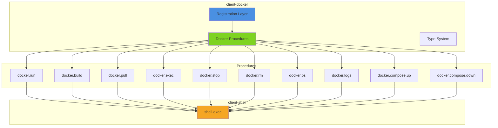
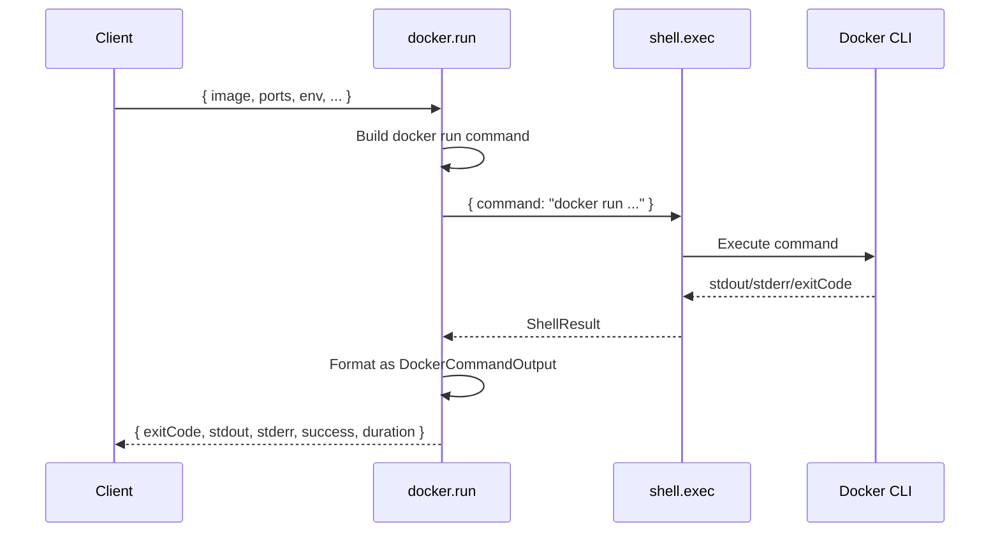

# @mark1russell7/client-docker

[](https://www.npmjs.com/package/@mark1russell7/client-docker)
[](https://opensource.org/licenses/MIT)

> Docker container management as procedures using client-shell

## Overview

`client-docker` wraps Docker CLI commands as procedures using `client-shell`. It provides a comprehensive set of procedures for container management, image building, Docker Compose orchestration, and more - all accessible through the procedure system's RPC interface.

### Key Features

- **Comprehensive Docker Coverage**: Run, build, pull, exec, stop, rm, ps, logs commands
- **Docker Compose Support**: Up and down operations for multi-container applications
- **Type-Safe Inputs**: Zod schemas for all inputs with full TypeScript support
- **Shell Integration**: Leverages `client-shell` for reliable CLI execution
- **Consistent Output**: Standardized output format across all procedures
- **CLI Wrapper Pattern**: One procedure per Docker command with full option support

## Architecture



### Data Flow



## Installation

```bash
npm install @mark1russell7/client-docker
```

Or with pnpm:

```bash
pnpm add @mark1russell7/client-docker
```

### Dependencies

This package depends on:
- `@mark1russell7/client` - Core client/procedure system
- `@mark1russell7/client-shell` - Shell execution for CLI commands
- `zod` - Schema validation and type inference

### System Requirements

- Docker must be installed and available in PATH
- For Docker Compose procedures: Docker Compose must be installed

## Usage

### Basic Container Operations

```typescript
import { Client } from "@mark1russell7/client";

const client = new Client(/* ... */);

// Run a container
const result = await client.call(["docker", "run"], {
  image: "nginx:latest",
  name: "my-nginx",
  ports: ["8080:80"],
  detach: true,
});

console.log(result);
// {
//   exitCode: 0,
//   stdout: "container_id_here\n",
//   stderr: "",
//   success: true,
//   duration: 1234
// }
```

### Building Images

```typescript
// Build an image from a Dockerfile
await client.call(["docker", "build"], {
  context: ".",
  tag: "my-app:latest",
  dockerfile: "Dockerfile",
  buildArgs: {
    NODE_VERSION: "20",
    APP_ENV: "production",
  },
  noCache: false,
});
```

### Executing Commands in Containers

```typescript
// Execute a command in a running container
await client.call(["docker", "exec"], {
  container: "my-nginx",
  command: "nginx -t",
  interactive: false,
  tty: false,
});

// Interactive shell session
await client.call(["docker", "exec"], {
  container: "my-app",
  command: "/bin/bash",
  interactive: true,
  tty: true,
  env: {
    DEBUG: "true",
  },
});
```

### Container Management

```typescript
// List all containers
const containers = await client.call(["docker", "ps"], {
  all: true,
  format: "json",
});

// Stop containers
await client.call(["docker", "stop"], {
  containers: ["nginx-1", "nginx-2"],
  time: 10, // Grace period in seconds
});

// Remove containers
await client.call(["docker", "rm"], {
  containers: ["nginx-1"],
  force: true,
  volumes: true,
});

// Get container logs
const logs = await client.call(["docker", "logs"], {
  container: "my-app",
  tail: 100,
  timestamps: true,
  follow: false,
});
```

### Docker Compose

```typescript
// Start services
await client.call(["docker", "compose", "up"], {
  file: "docker-compose.yml",
  detach: true,
  build: true,
  forceRecreate: false,
  services: ["web", "db"], // Optional: specific services
});

// Stop and remove services
await client.call(["docker", "compose", "down"], {
  file: "docker-compose.yml",
  volumes: true,
  removeOrphans: true,
  rmi: "local", // Remove images built locally
});
```

## API Reference

### Common Output Type

All Docker procedures return a standardized output format:

```typescript
interface DockerCommandOutput {
  exitCode: number;
  stdout: string;
  stderr: string;
  success: boolean;  // true if exitCode === 0
  duration: number;  // milliseconds
}
```

### Procedures

#### `docker.run`

Run a Docker container.

**Input:**
```typescript
{
  image: string;              // Required: Docker image
  name?: string;              // Container name
  ports?: string[];           // Port mappings ["host:container", ...]
  volumes?: string[];         // Volume mappings ["/host:/container", ...]
  env?: Record<string, string>; // Environment variables
  detach?: boolean;           // Run in background (default: false)
  rm?: boolean;               // Auto-remove when stopped (default: false)
  command?: string;           // Command to run in container
  cwd?: string;               // Working directory for command
  timeout?: number;           // Command timeout in ms
}
```

**Example:**
```typescript
await client.call(["docker", "run"], {
  image: "postgres:15",
  name: "my-db",
  ports: ["5432:5432"],
  env: {
    POSTGRES_PASSWORD: "secret",
    POSTGRES_DB: "myapp",
  },
  detach: true,
});
```

#### `docker.build`

Build a Docker image from a Dockerfile.

**Input:**
```typescript
{
  context: string;            // Required: Build context path
  tag: string;                // Required: Image tag
  dockerfile?: string;        // Dockerfile path (relative to context)
  buildArgs?: Record<string, string>; // Build arguments
  noCache?: boolean;          // Don't use cache (default: false)
  cwd?: string;               // Working directory
  timeout?: number;           // Build timeout in ms
}
```

**Example:**
```typescript
await client.call(["docker", "build"], {
  context: ".",
  tag: "my-app:v1.0.0",
  buildArgs: {
    NODE_VERSION: "20",
  },
  noCache: true,
});
```

#### `docker.pull`

Pull a Docker image from a registry.

**Input:**
```typescript
{
  image: string;              // Required: Image name
  tag?: string;               // Image tag (default: "latest")
  cwd?: string;               // Working directory
  timeout?: number;           // Pull timeout in ms
}
```

**Example:**
```typescript
await client.call(["docker", "pull"], {
  image: "nginx",
  tag: "alpine",
});
```

#### `docker.exec`

Execute a command in a running container.

**Input:**
```typescript
{
  container: string;          // Required: Container name or ID
  command: string;            // Required: Command to execute
  interactive?: boolean;      // Allocate stdin (default: false)
  tty?: boolean;              // Allocate pseudo-TTY (default: false)
  workdir?: string;           // Working directory inside container
  env?: Record<string, string>; // Environment variables
  cwd?: string;               // Working directory (host)
  timeout?: number;           // Command timeout in ms
}
```

**Example:**
```typescript
await client.call(["docker", "exec"], {
  container: "my-app",
  command: "npm run migrate",
  env: {
    DATABASE_URL: "postgres://...",
  },
});
```

#### `docker.stop`

Stop running containers.

**Input:**
```typescript
{
  containers: string[];       // Required: Container names/IDs
  time?: number;              // Seconds to wait before killing (default: 10)
  cwd?: string;               // Working directory
  timeout?: number;           // Command timeout in ms
}
```

**Example:**
```typescript
await client.call(["docker", "stop"], {
  containers: ["web-1", "web-2", "worker-1"],
  time: 30,
});
```

#### `docker.rm`

Remove containers.

**Input:**
```typescript
{
  containers: string[];       // Required: Container names/IDs
  force?: boolean;            // Force removal (default: false)
  volumes?: boolean;          // Remove volumes (default: false)
  cwd?: string;               // Working directory
  timeout?: number;           // Command timeout in ms
}
```

**Example:**
```typescript
await client.call(["docker", "rm"], {
  containers: ["temp-container"],
  force: true,
  volumes: true,
});
```

#### `docker.ps`

List containers.

**Input:**
```typescript
{
  all?: boolean;              // Show all containers (default: false)
  filter?: string;            // Filter output (e.g., "status=running")
  format?: string;            // Format output (e.g., "json")
  cwd?: string;               // Working directory
  timeout?: number;           // Command timeout in ms
}
```

**Example:**
```typescript
const result = await client.call(["docker", "ps"], {
  all: true,
  format: "json",
});

const containers = JSON.parse(result.stdout);
```

#### `docker.logs`

Get container logs.

**Input:**
```typescript
{
  container: string;          // Required: Container name or ID
  follow?: boolean;           // Follow log output (default: false)
  tail?: number;              // Number of lines from end
  timestamps?: boolean;       // Show timestamps (default: false)
  cwd?: string;               // Working directory
  timeout?: number;           // Command timeout in ms
}
```

**Example:**
```typescript
const logs = await client.call(["docker", "logs"], {
  container: "my-app",
  tail: 50,
  timestamps: true,
});

console.log(logs.stdout);
```

#### `docker.compose.up`

Start services with Docker Compose.

**Input:**
```typescript
{
  file?: string;              // Compose file path (default: "docker-compose.yml")
  services?: string[];        // Services to start (default: all)
  detach?: boolean;           // Run in background (default: false)
  build?: boolean;            // Build images before starting (default: false)
  forceRecreate?: boolean;    // Force recreate containers (default: false)
  cwd?: string;               // Working directory
  timeout?: number;           // Command timeout in ms
}
```

**Example:**
```typescript
await client.call(["docker", "compose", "up"], {
  file: "docker-compose.prod.yml",
  services: ["web", "db"],
  detach: true,
  build: true,
});
```

#### `docker.compose.down`

Stop and remove services with Docker Compose.

**Input:**
```typescript
{
  file?: string;              // Compose file path (default: "docker-compose.yml")
  volumes?: boolean;          // Remove volumes (default: false)
  removeOrphans?: boolean;    // Remove orphan containers (default: false)
  rmi?: "all" | "local";      // Remove images (all or local only)
  cwd?: string;               // Working directory
  timeout?: number;           // Command timeout in ms
}
```

**Example:**
```typescript
await client.call(["docker", "compose", "down"], {
  volumes: true,
  removeOrphans: true,
  rmi: "local",
});
```

## Types

### Input Types

All input types are exported with Zod schemas for validation:

```typescript
import {
  DockerRunInput,
  DockerRunInputSchema,
  DockerBuildInput,
  DockerBuildInputSchema,
  // ... etc
} from "@mark1russell7/client-docker";

// Validate input
const parsed = DockerRunInputSchema.parse({
  image: "nginx",
  ports: ["80:80"],
});
```

### Output Type

```typescript
export interface DockerCommandOutput {
  /** Exit code of the command */
  exitCode: number;
  /** Standard output */
  stdout: string;
  /** Standard error */
  stderr: string;
  /** Whether command succeeded (exit code 0) */
  success: boolean;
  /** Duration in milliseconds */
  duration: number;
}
```

## Integration with Ecosystem

### With bundle-dev

The `bundle-dev` package includes `client-docker` for development workflows:

```typescript
import "@mark1russell7/bundle-dev/register.js";

// docker.* procedures are now available
await client.call(["docker", "run"], { ... });
```

### With client-shell

`client-docker` uses `client-shell` under the hood:

```typescript
// Internally, docker.run calls:
await ctx.client.call(["shell", "exec"], {
  command: "docker run -d -p 8080:80 --name my-nginx nginx",
});
```

### With client-fs

Combine with `client-fs` for Dockerfile management:

```typescript
// Write Dockerfile
await client.call(["fs", "write"], {
  path: "Dockerfile",
  content: `
FROM node:20-alpine
WORKDIR /app
COPY . .
RUN npm ci --production
CMD ["node", "index.js"]
  `.trim(),
});

// Build image
await client.call(["docker", "build"], {
  context: ".",
  tag: "my-app:latest",
});
```

## Advanced Usage

### Multi-Container Applications

```typescript
// Start entire stack
await client.call(["docker", "compose", "up"], {
  detach: true,
  build: true,
});

// Check service status
const containers = await client.call(["docker", "ps"], {
  all: false,
  format: "json",
});

// View logs for specific service
const webLogs = await client.call(["docker", "logs"], {
  container: "myapp-web-1",
  tail: 100,
});

// Clean up
await client.call(["docker", "compose", "down"], {
  volumes: true,
});
```

### Custom Build Process

```typescript
// Multi-stage build with build args
await client.call(["docker", "build"], {
  context: ".",
  tag: "my-app:production",
  dockerfile: "Dockerfile.prod",
  buildArgs: {
    NODE_VERSION: "20",
    NPM_TOKEN: process.env.NPM_TOKEN,
    BUILD_ENV: "production",
  },
  noCache: true,
});

// Tag for registry
await client.call(["shell", "exec"], {
  command: "docker tag my-app:production registry.example.com/my-app:latest",
});

// Push to registry
await client.call(["shell", "exec"], {
  command: "docker push registry.example.com/my-app:latest",
});
```

### Container Health Checks

```typescript
// Wait for container to be healthy
async function waitForHealthy(container: string, maxAttempts = 30) {
  for (let i = 0; i < maxAttempts; i++) {
    const result = await client.call(["docker", "ps"], {
      filter: `name=${container}`,
      format: "json",
    });

    const containers = JSON.parse(result.stdout);
    if (containers[0]?.Status?.includes("healthy")) {
      return true;
    }

    await new Promise(resolve => setTimeout(resolve, 1000));
  }

  throw new Error(`Container ${container} did not become healthy`);
}
```

## Error Handling

```typescript
try {
  await client.call(["docker", "run"], {
    image: "nonexistent:image",
    detach: true,
  });
} catch (error) {
  // Handle Docker errors
  if (error.stderr?.includes("Unable to find image")) {
    console.error("Image not found");
  } else if (error.stderr?.includes("port is already allocated")) {
    console.error("Port conflict");
  }
}

// Check success field
const result = await client.call(["docker", "build"], {
  context: ".",
  tag: "my-app",
});

if (!result.success) {
  console.error("Build failed:", result.stderr);
  throw new Error("Docker build failed");
}
```

## Performance Considerations

- **Detached Mode**: Use `detach: true` for long-running containers to avoid blocking
- **Build Cache**: Avoid `noCache: true` unless necessary to speed up builds
- **Timeouts**: Set appropriate timeouts for long-running operations (builds, pulls)
- **Cleanup**: Use `rm: true` for one-off containers to avoid accumulation
- **Docker Compose**: Prefer `docker.compose.up` for multi-container apps vs. multiple `docker.run` calls

## Testing

The package includes both unit and integration tests:

```bash
# Run all tests
pnpm test

# Unit tests only
pnpm test:unit

# Integration tests (requires Docker)
pnpm test:integration

# Watch mode
pnpm test:watch

# Coverage
pnpm test:coverage
```

## License

MIT

## Related Packages

- `@mark1russell7/client` - Core client/procedure system
- `@mark1russell7/client-shell` - Shell command execution
- `@mark1russell7/bundle-dev` - Development bundle
- `@mark1russell7/client-fs` - Filesystem operations
